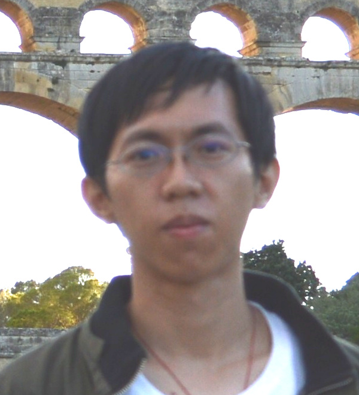

I am currently an associate professor at [Telecom Paris](https://www.telecom-paris.fr/), [Institut Polytechnique de Paris](https://www.ip-paris.fr), as a member of the [Cybersecurity-Cryptography team](https://www.telecom-paris.fr/en/research/laboratories/information-processing-and-communication-laboratory-ltci/research-teams/cybersecurity-cryptography-c2). From 2019 to 2021, I was a postdoc in the <a href="https://www.irisa.fr/emsec/?p=presentation">EMSEC</a> team of the <a href="http://www.irisa.fr/">IRISA</a> laboratory,
working with <a href="https://www.di.ens.fr/~fouque/">Pierre-Alain Fouque</a> and <a href="http://people.irisa.fr/Adeline.Roux-Langlois/">Adeline Roux-Langlois</a>. In between, I also spent 6 months as a research engineer at [TII](https://www.tii.ae).

I have completed my PhD under the supervison of [Damien Stehl&eacute;](http://perso.ens-lyon.fr/damien.stehle/) in [LIP](http://www.ens-lyon.fr/LIP) of ENS de Lyon on [hardness of difficult problems in lattices](http://people.irisa.fr/Weiqiang.Wen/thesis.html).

**Research interests**: Cryptography; Lattice-based problems

## Contact details
INFRES Department  
Telecom Paris, Institut Polytechnique de Paris  
13 Avenue de la Vauve  
91120 Palaiseau  
Email: weiqiang "dot" wen "at" telecom-paris "dot" fr  

## Publications
- [Katharina Boudgoust](https://katinkabou.github.io/), Corentin Jeudy, [Adeline Roux-Langlois](http://people.irisa.fr/Adeline.Roux-Langlois/) and Weiqiang Wen. [On the Hardness of Module-LWE with Binary Secret](https://eprint.iacr.org/2021/265). To appear in [CT-RSA 2021](https://sites.google.com/site/ctrsa2021/home).
- [Katharina Boudgoust](https://katinkabou.github.io/), Corentin Jeudy, [Adeline Roux-Langlois](http://people.irisa.fr/Adeline.Roux-Langlois/) and Weiqiang Wen. [Towards Classical Hardness of Module-LWE: The Linear Rank Case](https://eprint.iacr.org/2020/1020). [Asiacrypt 2020](https://asiacrypt.iacr.org/2020/).
- [Martin R. Albrecht](https://malb.io/), [Shi Bai](https://maths-people.anu.edu.au/~bai/), [Pierre-Alain Fouque](https://www.di.ens.fr/~fouque/), Paul Kirchner, [Damien Stehl&eacute;](http://perso.ens-lyon.fr/damien.stehle/) and Weiqiang Wen. [Faster Enumeration-based Lattice Reduction: Root Hermite Factor k^(1/(2k)) in Time k^(k/8 + o(k))](https://eprint.iacr.org/2020/707). [Crypto 2020](https://crypto.iacr.org/2020/).
- [Shi Bai](https://maths-people.anu.edu.au/~bai/), [Katharina Boudgoust](https://katinkabou.github.io/), Dipayan Das, [Adeline Roux-Langlois](http://people.irisa.fr/Adeline.Roux-Langlois/), Weiqiang Wen and [Zhenfei Zhang](https://zhenfeizhang.github.io/). [Middle-Product Learning with Rounding Problem and its Applications](https://eprint.iacr.org/2019/1001). [Asiacrypt 2019](https://asiacrypt.iacr.org/2019/).
- [Shi Bai](https://maths-people.anu.edu.au/~bai/), Shaun Miller and Weiqiang Wen. [A refined analysis of the cost for solving
LWE via uSVP](https://eprint.iacr.org/2019/502). [Africacrypt 2019](http://africacrypt2019.aui.ma/index.php).
- [Shi Bai](https://maths-people.anu.edu.au/~bai/), [Damien Stehl&eacute;](http://perso.ens-lyon.fr/damien.stehle/) and Weiqiang Wen. [Measuring, simulating and exploiting the head concavity phenomenon in BKZ](https://eprint.iacr.org/2018/856). [Asiacrypt 2018](https://pkc.iacr.org/2018/).
- [Zvika Brakerski](http://www.wisdom.weizmann.ac.il/~zvikab/), [Elena Kirshanova](http://perso.ens-lyon.fr/elena.kirshanova/), [Damien Stehl&eacute;](http://perso.ens-lyon.fr/damien.stehle/) and Weiqiang Wen. [Learning With Errors and Extrapolated Dihedral Cosets](https://arxiv.org/abs/1710.08223). [PKC 2018](https://pkc.iacr.org/2018/).
- [Shi Bai](https://maths-people.anu.edu.au/~bai/), [Damien Stehl&eacute;](http://perso.ens-lyon.fr/damien.stehle/) and Weiqiang Wen. [Improved Reduction from the Bounded Distance Decoding Problem to the Unique Shortest Vector Problem in Lattices](http://eprint.iacr.org/2016/753). [ICALP 2016](http://www.easyconferences.eu/icalp2016/).
- Weiqiang Wen, [Libin Wang](https://www.researchgate.net/profile/Libin_Wang6) and [Jiaxin Pan](https://www.ntnu.edu/employees/jiaxin.pan). [A Unified Security Model of Authenticated Key Exchange with Specific Adversarial Capabilities](http://eprint.iacr.org/2013/871). [IET Information Security 2016](http://digital-library.theiet.org/content/journals/10.1049/iet-ifs.2014.0234).

## Recent talks

- 20/08/2020: Faster Enumeration-based Lattice Reduction: Root Hermite Factor k^(1/(2k)) in Time k^(k/8 + o(k)), [Crypto 2020](https://crypto.iacr.org/2020/) ([Lattices and Related Problems](https://crypto.iacr.org/2020/program.php#day-2020-08-20)).
- 19-20/04/2018: Toward a more accurate BKZ simulator, [Lattice Meeting](https://crypto.iacr.org/2020/program.php#day-2020-08-20) in ENS Lyon, France.
- 29/03/2018: [Learning With Errors and Extrapolated Dihedral Cosets Problem](./lweedcp_PKC.pdf), [PKC 2018](https://pkc.iacr.org/2018/) in Rio de Janeiro, Brazil.
- 23/02/2018: Learning With Errors and Extrapolated Dihedral Cosets Problem, [S&eacute;minaire de Cryptographie](https://webmath.univ-rennes1.fr/crypto/) in Institut de Recherche en Math&eacute;matiques de Rennes, France.
- 16/01/2018: Learning With Errors and Extrapolated Dihedral Cosets Problem, [S&eacute;minaire Protection de l'Information, Codage, Cryptographie](https://indico.math.cnrs.fr/event/3104/) in Universit&eacute; de Limoges, France.
- 24/04/2017: Learning With Errors and Extrapolated Dihedral Cosets Problem, [Journ&eacute;es Codage & Cryptographie 2017](https://jc2-2017.inria.fr/) in La Bresse, France.
- 15-16/12/2016: Learning With Errors and the Generalized Hidden Shift Problem, [Lattice Meeting](http://perso.ens-lyon.fr/damien.stehle/LATTICE_MEETINGS.html) in ENS Lyon, France.
- 05/10/2016: [Improved reduction from BDD to uSVP](./bddusvp_Caen.pdf),  [S&eacute;minaire Cryptologie & S&eacute;curit&eacute;](https://barbierm01.users.greyc.fr/seminaire_crypto/seminaire.html) in Universit&eacute; de Caen, France.
- 15/07/2016: [Improved reduction from BDD to uSVP](./bddusvp_ICALP.pdf), [ICALP 2016](http://www.easyconferences.eu/icalp2016) in Rome, Italy.
- 02/06/2016: [Improved reduction from BDD to uSVP](./bddusvp_AriC.pdf), [AriC seminar](http://www.ens-lyon.fr/LIP/AriC/seminar) in Lyon, France.

Last update: 16/12/2021.
